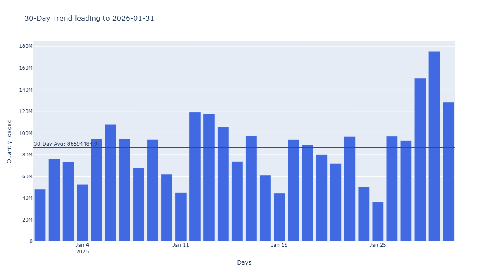
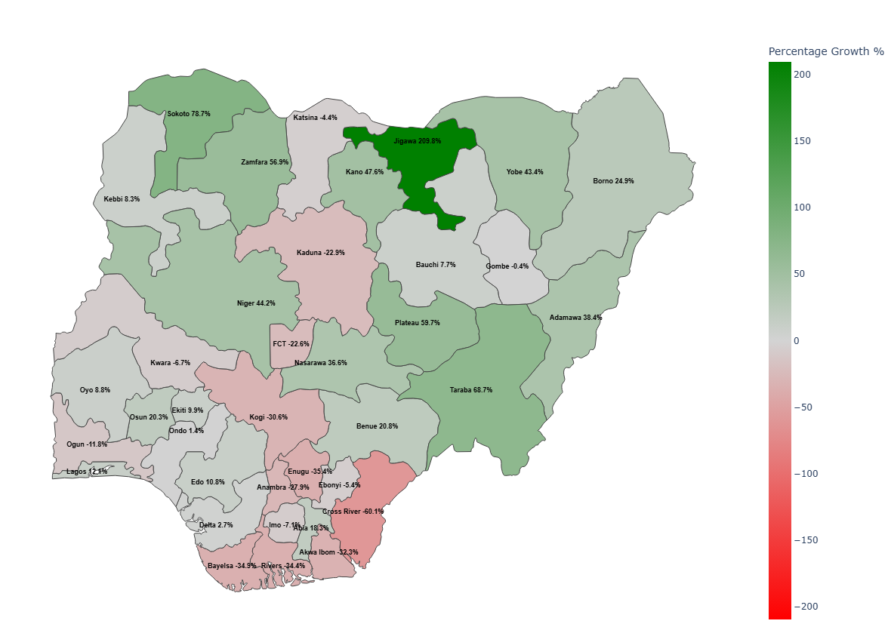

# 🇳🇬 Nigerian Downstream Chain Growth Monitor  
**An Interactive 30-Day Performance Analytics Dashboard**

## 📌 Overview

The **Nigerian Downstream Chain Growth Monitor** is an interactive data analytics dashboard built with **Python, Dash, and Plotly** to monitor short-term performance trends in Nigeria’s downstream logistics chain.

The system compares **daily performance against a rolling 30-day historical baseline**, highlights growth or decline, and visualizes state-level changes on a **geographic map of Nigeria**.

This tool is designed to support **data-driven decision making**, trend monitoring, and early signal detection across multiple regions.

---

## 🎯 What Problem This Solves

Organizations often collect large volumes of operational data but lack tools to:

- Track short-term performance trends  
- Compare today’s performance against recent history  
- Identify which regions are improving or declining  
- Visualize insights geographically instead of in spreadsheets  

This dashboard turns raw operational data into **clear, actionable insight**.

---

## 🧠 Core Analytics Logic

For any selected analysis date:

### 1️⃣ Rolling 30-Day Window
- The system looks **30 days backward** from the selected date  
- Computes the **average daily quantity** over that window  

### 2️⃣ Daily Comparison
- The selected day’s total quantity is compared against the 30-day average  

**Status Logic:**
- 🟢 **Green** → Today’s value is above the 30-day average (growth)  
- 🔴 **Red** → Today’s value is below the 30-day average (decline)  
- ⚪ **Grey** → Today’s value equals the average (no change)  

---

## 📊 Visualizations

### 🔹 1. 30-Day Trend Bar Chart
- Displays daily quantities for the previous 30 days  
- Includes a horizontal reference line representing the 30-day average  
- Line color dynamically reflects growth, decline, or neutrality  

This helps users quickly assess **recent momentum leading into the selected day**.

---

### 🔹 2. Nigerian State-Level Growth Map
- Visualizes performance across all Nigerian states  
- Each state is colored based on **percentage growth or decline** relative to its 30-day average  
- Percentage change is displayed directly on the map  

**Color scale:**
- 🔴 Red → Decline  
- ⚪ Grey → No change  
- 🟢 Green → Growth  

This allows instant identification of **regional performance differences**.

---

## 🛠️ Tech Stack

- **Python**
- **Dash** – Interactive dashboard framework  
- **Plotly** – Charts and geospatial visualization  
- **Pandas** – Data processing and analytics  
- **GeoJSON** – Nigerian state boundaries  

---

## 📂 Project Structure
<pre>
├── app.py                 # Main Dash application
├── utils.py               # State center coordinates
├── data/
│   ├── data.parquet       # Cleaned dataset
│   └── ng.json            # Nigeria GeoJSON
├── requirements.txt
└── README.md
</pre>

---

## 🚀 How to Run the App

### 1️⃣ Clone the Repository
```bash
git clone <repo-url>
cd <repo-folder>
```
### Create Virtual Environment
```bash
python -m venv venv
venv\Scripts\activate     # Windows
source venv/bin/activate  # Mac and Linux
```

### 3️⃣ Install Dependencies
```bash
pip install -r requirements.txt
```

### 4️⃣ Run the App
```bash
python app.py
```
Open your browser at:
```cpp
http://127.0.0.1:8050
```

---

## 📈 Potential Use Cases

This system can be adepted for:
- Logistics & supply chain monitoring
- Public health trend analysis
- Sales performance tracking
- Energy distribution monitoring
- Government & NGO reporting
- Regional KPI dashboards
The analytics logic is data-agnostic and can be reused with different datasets.

---

🔍 Why This Project Matters
This Project demonstrates:
- Real-world data cleaning and transformation
- Time-series analytics
- Rolling window performance evaluation
- Geographic data visualization
- Building production-style interactive dashboards
It goes beyond plotting data by **turning metrics into insight**.

---

## The plots

<p align="center">
  
  
</p>

## 📬 Author

**Eze Ugwunweze**
Python / Data Analytics / Visualization

